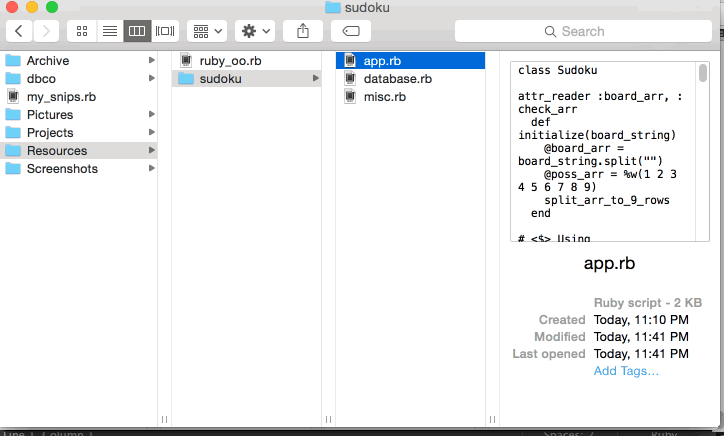

Snip 
====
*Your code, snipped*

Snip is an open source code snippet manager. With a simple command line interface, you can easily tag and save your code for future review.
<p align="center">

</p>

## How it works

Snip uses simple, easy-to-remember tags that you place inside your code during your normal workflow:
```ruby
# <$> Using a times loop
5 times do |x|
  puts x
end
 # </$>
```

At the end of the day, run `snip <filename/directory>` to update your snippet file with a single file or a whole directory of tagged files:

```ruby
# **** Snippet 1: Using a times loop ****
# Snipped from test.rb:4 on 12/08/2014
5 times do |x|
  puts x
end
```

The original file tags will be modified slightly with `<*$*>` tags so you can rerun `snip` on your directory without duplicating old files.

## Setup
*Installation:*
Snip requires Ruby and Ruby gems on your computer.

To install (TBD):
```
gem install snipgem
```

First time use:
```
snip -f ~/desktop/my_snips.rb
```
where '~/desktop/my_snips.rb' is the name of the file you would like to save to. Run `snip -f` again to relocate your snip file if you move or rename it at any point.

Future use:
```
snip directory_name/
```
or
```
snip filename.rb
```

Currently only Ruby files are supported.


